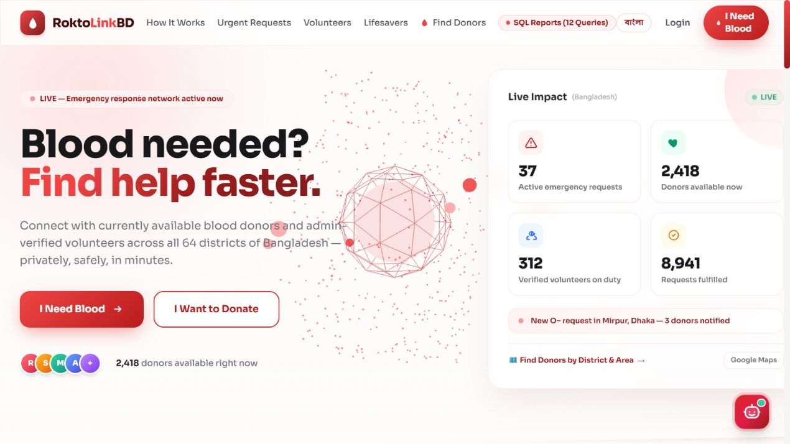
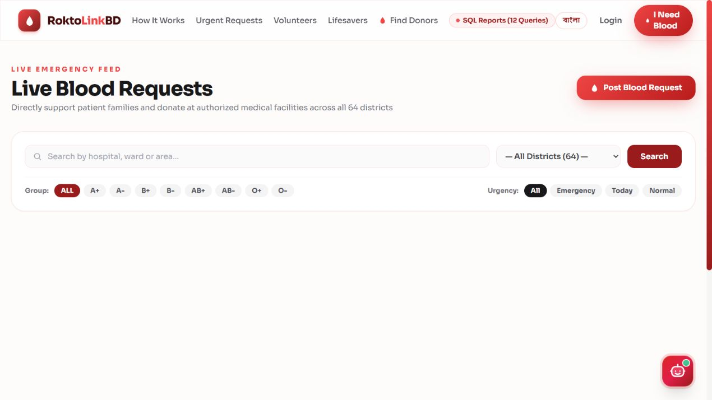
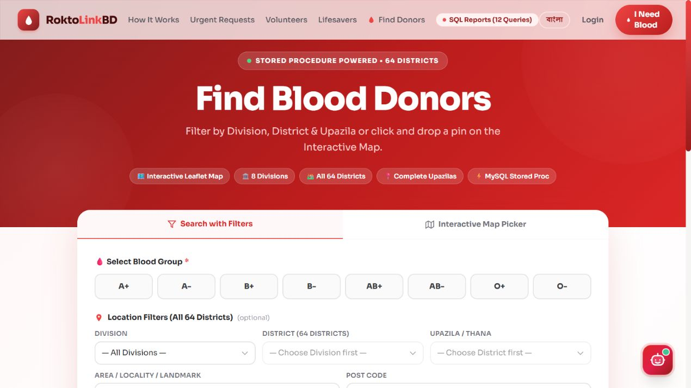
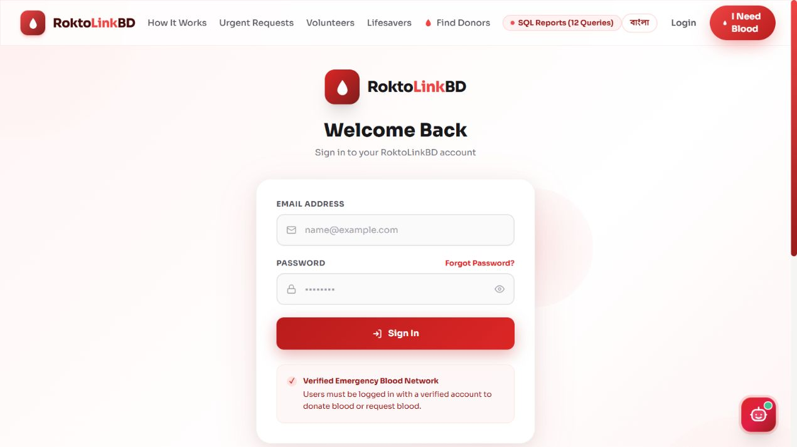
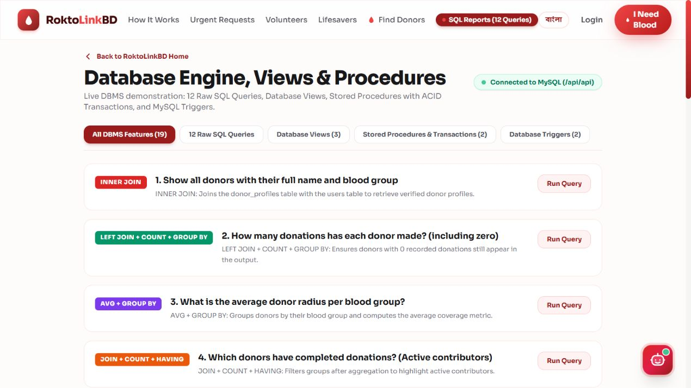
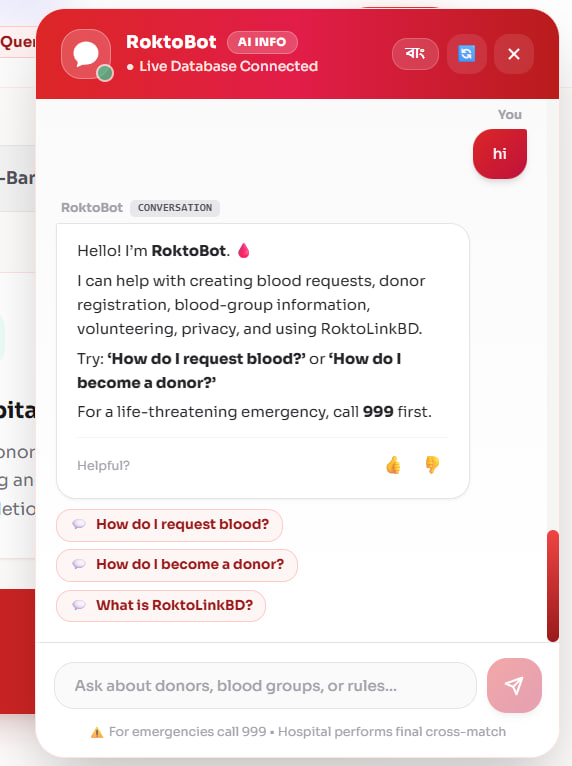
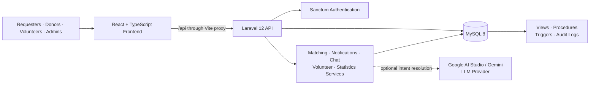

<div align="center">

# 🩸 RoktoLinkBD

### *A full-stack emergency blood-donation coordination platform for Bangladesh.*

<br/>

[](https://react.dev/)
[](https://www.typescriptlang.org/)
[](https://vite.dev/)
[](https://laravel.com/)
[](https://www.php.net/)
[](https://www.mysql.com/)

<br/>

[](https://aistudio.google.com/)
[](https://laravel.com/docs/sanctum)
[](#-database-engineering)

<br/>

[](https://github.com/faysaliqbal007/Blood-Donation-System)

</div>

---

## 📖 Table of Contents

- [Overview](#-overview)
- [Core Features](#-core-features)
- [Platform Previews](#-platform-previews)
- [Technology Stack](#-technology-stack)
- [Architecture & Coordination Flow](#-architecture--coordination-flow)
- [Security & Safety Design](#-security--safety-design)
- [Database Engineering](#-database-engineering)
- [Getting Started](#-getting-started)
- [Environment Variables](#-environment-variables)
- [Available Commands](#-available-commands)
- [API Highlights](#-api-highlights)
- [Project Structure](#-project-structure)
- [Development Team](#-development-team)
- [Contributing](#-contributing)
- [Troubleshooting](#-troubleshooting)
- [License](#-license)

---

## 🌐 Overview

**RoktoLinkBD** is a role-based coordination platform for emergency blood donation in Bangladesh. It connects patients and families with eligible donors and verified volunteers through a structured, privacy-aware workflow.

| What the platform solves | How RoktoLinkBD handles it |
| --- | --- |
| 🩸 Urgent blood needs | Emergency request board with blood group, hospital, location, unit, and urgency details |
| 📍 Finding suitable donors | Blood-group compatibility, location context, availability, and donation-cooldown checks |
| 🔐 Sensitive contact data | Protected coordination details revealed only to authorized matched participants |
| 👥 Volunteer reliability | Application, verification, approval, rejection, and suspension workflow |
| 🤖 Donation guidance | RoktoBot knowledge-base assistant with optional Gemini LLM understanding |
| 📊 Database demonstration | Live report pages powered by SQL joins, views, procedures, triggers, and audit data |

> **University project note:** RoktoLinkBD demonstrates modern full-stack development and database engineering. It supports coordination only; clinical screening, blood collection, and emergency care remain the responsibility of authorized medical services.

## ✨ Core Features

- Multi-step account access: registration, email verification, login, logout, and password reset.
- Emergency blood request creation, filtering, detail pages, donation offers, and fulfillment tracking.
- Donor onboarding with blood group, location, availability radius, and 90-day cooldown support.
- Compatibility-based donor matching and accept/decline response flow.
- Private, authorized coordination views and case messaging after a donor accepts.
- Volunteer application pipeline with administrator moderation tools.
- Live network statistics, urgent request cards, donor group summaries, and a Wall of Lifesavers.
- English / বাংলা language toggle across the interface.
- RoktoBot assistant with knowledge-base answers, feedback, escalation, and configurable LLM providers.
- SQL Reports page demonstrating practical database queries and server-side database objects.

## 🖼️ Platform Previews

> 📂 All documentation images are browser-window-size captures from [`assets/screenshots/`](assets/screenshots/). They are kept in the repository so GitHub renders the previews directly.

### 🏠 1. Emergency Coordination Homepage

<p align="center">
  
</p>

> A responsive entry point for emergency discovery, donor availability, impact statistics, volunteer participation, and donation guidance.

### 🩸 2. Active Requests & Donor Search

<p align="center">
  
  
</p>

> Two purpose-driven views: one for urgent request discovery and another for locating compatible donors by blood group and location.

### 🔐 3. Authentication Hub

<p align="center">
  
</p>

> Secure onboarding begins with email and password login, followed by email-verification and account-recovery flows when necessary.

### 📈 4. SQL Query & Database Reports

<p align="center">
  
</p>

> A dedicated reporting dashboard that turns database concepts—joins, aggregate functions, subqueries, views, procedures, and triggers—into visible, testable application output.

### 🤖 5. RoktoBot Assistant

<p align="center">
  
</p>

> A compact assistant panel for blood donation and platform guidance. RoktoBot prioritizes the local knowledge base and can optionally use Google Gemini or other configured LLM providers for intent understanding.

## 🛠️ Technology Stack

### Frontend

| Technology | Version | Purpose |
| --- | --- | --- |
| **React** | 19 | Component-based user interface |
| **TypeScript** | 6 | Typed components, routes, and API contracts |
| **Vite** | 8 | Fast development server, HMR, and production builds |
| **React Router** | 7 | Client-side navigation and protected routes |
| **Axios** | 1.x | HTTP client and bearer-token request interceptor |
| **Leaflet** | 1.9 | Interactive location-oriented UI support |

### Backend & Data Layer

| Technology | Version | Purpose |
| --- | --- | --- |
| **PHP** | 8.2+ | Server-side runtime |
| **Laravel** | 12 | REST API, validation, Eloquent models, services, and migrations |
| **Laravel Sanctum** | 4 | Personal-access-token authentication |
| **Livewire** | 4 | Laravel server-rendered UI support |
| **MySQL** | 8+ | Relational schema, transactions, views, procedures, triggers, and audit data |
| **PHPUnit** | 11 | Backend automated tests |

### AI / LLM Layer

| Technology | Purpose |
| --- | --- |
| **Google AI Studio / Gemini** | Optional hosted LLM provider for RoktoBot intent resolution |
| **Knowledge Base** | Curated blood-donation and platform guidance used before external AI fallback |
| **OpenAI-compatible endpoint** | Optional configurable LLM integration |
| **Ollama** | Optional self-hosted local LLM provider |
| **Local NLP fallback** | Bounded response path when external AI is disabled or unavailable |

## 🏗️ Architecture & Coordination Flow



### Emergency request workflow

```text
Requester creates a verified request
          ↓
Laravel validates request data and stores it in MySQL
          ↓
Matching workflow finds compatible, available donors
          ↓
Donor accepts or declines the request
          ↓
Authorized requester / donor / volunteer coordination begins
          ↓
Donation fulfillment updates request progress and audit history
```

## 🔐 Security & Safety Design

### 1. Token-based authenticated access

- Laravel Sanctum issues a personal access token after valid login.
- Axios automatically sends the token on protected frontend requests.
- Laravel routes use `auth:sanctum` middleware for protected resources.
- React protected routes guide unauthenticated users to the login screen.

```http
Authorization: Bearer <token>
```

### 2. Private contact sharing

Contact details are protected from public listing. The API checks whether a user is the requester, an accepted donor, an eligible volunteer, or an administrator before exposing coordination data.

### 3. Donation eligibility controls

- Application logic tracks the 90-day post-donation cooldown.
- Eligible donor lookups consider profile status, availability, blood group, and location.
- A database trigger blocks donation records from ineligible donors.

### 4. Reliable database state

- Fulfillment uses a stored procedure with transaction and rollback handling.
- Donation inserts update the linked request progress automatically.
- Blood-request status changes create audit-log records.

## 🗃️ Database Engineering

| Object | What it demonstrates |
| --- | --- |
| `vw_donor_master_summary` | Relational joins and donor/donation summary reporting |
| `vw_emergency_request_board` | Active request presentation with urgency and progress |
| `vw_hospital_donation_stats` | Facility-level aggregation and donation statistics |
| `sp_get_eligible_donors_by_group` | Parameterized donor search by blood group and location |
| `sp_fulfill_blood_request` | ACID-style transactional request fulfillment |
| `trg_before_donation_prevent_ineligible` | Database-level donor eligibility protection |
| `trg_after_donation_update_request` | Automatic request-progress synchronization |
| `trg_audit_request_status_change` | Event-style audit history for request status updates |

## 🚀 Getting Started

### Prerequisites

- **PHP** `>= 8.2`
- **Composer**
- **Node.js** `>= 20` and npm
- **MySQL** `>= 8` or compatible MariaDB

### Step 1 — Clone the repository

```powershell
git clone https://github.com/faysaliqbal007/Blood-Donation-System.git
cd Blood-Donation-System
```

### Step 2 — Install and configure the backend

```powershell
cd backend
composer install
copy .env.example .env
php artisan key:generate
```

Update the database variables in `backend/.env`, then run:

```powershell
php artisan migrate --seed
```

### Step 3 — Install the frontend

```powershell
cd ..\frontend
npm install
```

### Step 4 — Start both applications

Open two terminals:

```powershell
# Terminal 1 — Backend API
cd "D:\Projects\University\3.1\SQL\Blood-Donation-System\Blood-Donation-System\backend"
php artisan serve --host=127.0.0.1 --port=8000
```

```powershell
# Terminal 2 — Frontend
cd "D:\Projects\University\3.1\SQL\Blood-Donation-System\Blood-Donation-System\frontend"
npm run dev -- --host 127.0.0.1
```

Open **http://127.0.0.1:5173** in a browser.

## ⚙️ Environment Variables

> Never commit production credentials or API keys. Use `backend/.env` for local settings only.

### `backend/.env`

```env
APP_NAME="RoktoLinkBD"
APP_ENV=local
APP_URL=http://127.0.0.1:8000

DB_CONNECTION=mysql
DB_HOST=127.0.0.1
DB_PORT=3306
DB_DATABASE=roktolinkbd
DB_USERNAME=<your_mysql_user>
DB_PASSWORD=<your_mysql_password>
```

### Optional Google AI Studio / Gemini configuration

```env
AI_PROVIDER=gemini
GEMINI_API_KEY=<your_google_ai_studio_key>
GEMINI_MODEL=<your_gemini_model>
LLM_TIMEOUT=15
```

Without an external API key, RoktoBot can use its knowledge-base and local fallback behavior. The resolver also supports OpenAI-compatible and Ollama providers when configured.

### `frontend/.env`

```env
# Leave unset in local development: Vite proxies /api to Laravel on port 8000.
# VITE_API_URL=https://api.example.com/api
```

## 📜 Available Commands

### Backend (`backend/`)

| Command | Description |
| --- | --- |
| `php artisan serve --host=127.0.0.1 --port=8000` | Start Laravel on the API port |
| `php artisan test` | Run backend automated tests |
| `php artisan route:list --path=api` | Inspect API routes |
| `php artisan migrate --seed` | Run the schema and sample-data setup |

### Frontend (`frontend/`)

| Command | Description |
| --- | --- |
| `npm run dev` | Start the Vite development server |
| `npm run build` | Type-check and create a production build |
| `npm run preview` | Preview the production build locally |
| `npm run lint` | Run frontend linting |

## 🔌 API Highlights

| Domain | Representative endpoints |
| --- | --- |
| Authentication | `POST /api/auth/register`, `POST /api/auth/login`, `GET /api/auth/me`, `POST /api/auth/logout` |
| Requests | `GET/POST /api/requests`, coordination, messages, donation offers |
| Donors | donor registration, location/availability updates, pending matches, `/api/donors/search` |
| Volunteers | `POST /api/volunteer/apply`, `/api/admin/volunteers/*` |
| Platform data | `/api/stats`, `/api/groups-summary`, `/api/lifesavers` |
| RoktoBot | `/api/roktobot`, feedback, escalation, preferences |
| Reports | `/api/reports/*` for query reports and database-object demonstrations |

## 📁 Project Structure

```text
Blood-Donation-System/
├── assets/
│   └── screenshots/              # GitHub-ready browser viewport images
├── backend/
│   ├── app/                      # Models, services, controllers, middleware
│   ├── config/                   # Laravel and RoktoBot configuration
│   ├── database/                 # Migrations, seeders, views, procedures, triggers
│   ├── routes/                   # API and web routes
│   └── tests/                    # Automated backend tests
├── frontend/
│   └── src/                      # React components, pages, context, API client
├── PROJECT_ARCHITECTURE.md       # Detailed design document
├── PROJECT_PROGRESS.md           # Milestone and implementation record
└── README.md
```

## 👥 Development Team

<div align="center">

| 👤 Member | 🎯 Role | 🔧 Key Contributions |
| --- | --- | --- |
| **Ishraq Alam Khan** | Backend Core & Frontend Foundation | Core API routes, models, migrations, matching, analytics, statistics services, typed API client, foundational setup, and donor-eligibility procedure. |
| **Nahid Hasan Nafi** | Frontend Experience & Reference Data | User-facing pages, responsive components, donor/request workflows, trust pages, navigation, location/role seeders, and reporting views. |
| **M M Faysal Iqbal** | AI, Coordination & Database Automation | RoktoBot, LLM intent resolution, chat/notification/volunteer services, triggers, fulfillment procedure, audit/AI schema, seeders, reports UI, and chatbot interface. |

</div>

---

## 🤝 Contributing

1. Create a feature branch from the latest `main` branch.
2. Set your Git identity so your contributions are correctly attributed.
3. Pull before starting work: `git pull --rebase origin main`.
4. Keep each commit focused and meaningful—for example: `feat(api): add donor availability endpoint`.
5. Do not overwrite, rename, or delete another contributor's active work without agreement.
6. Run the appropriate backend tests or `npm run build` before opening a pull request.
7. Describe the behavior changed, database objects affected, and verification completed.

## 🧰 Troubleshooting

| Issue | Resolution |
| --- | --- |
| **Port 8000 is already in use** | Stop the other PHP/Laravel process, then run this repository's backend server. |
| **Login returns 404** | Confirm `php artisan serve` was started inside `backend/`; login is `POST /api/auth/login`. |
| **Frontend cannot connect** | Start both apps and keep Vite's `/api` proxy target set to `http://127.0.0.1:8000`. |
| **MySQL connection error** | Ensure MySQL is running and re-check `DB_*` values in `backend/.env`. |
| **Migration permissions error** | Use a MySQL account that can create views, procedures, and triggers. |
| **RoktoBot LLM unavailable** | Check the provider key/configuration; the app falls back to knowledge-base/local behavior. |

## 📚 Project Documents

- [Architecture reference](PROJECT_ARCHITECTURE.md)
- [Project progress](PROJECT_PROGRESS.md)
- [Backend documentation](backend/README.md)
- [Frontend documentation](frontend/README.md)

## 📄 License

No license has been declared for this project. Contact the team before reusing or redistributing its source code.

<div align="center">

### Made with care for safer blood-donation coordination in Bangladesh 🇧🇩

</div>
