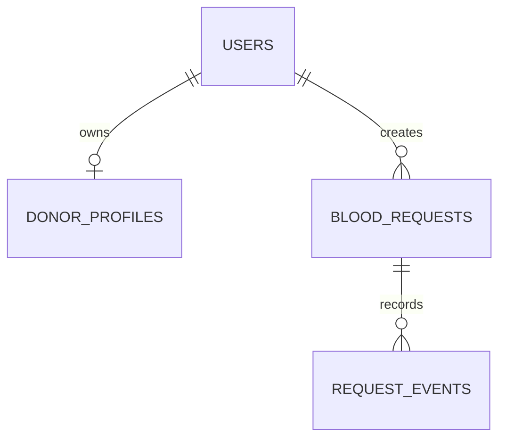

<div align="center">

# RoktoLinkBD

### Connecting Donors. Responding Faster. Saving Lives Together.

_A privacy-first emergency blood-donation coordination platform for Bangladesh._

[](https://laravel.com)
[](https://www.php.net)
[](https://vite.dev)
[](https://tailwindcss.com)

[Explore the UI](#-interface-preview) · [Get started](#-quick-start) · [Architecture](#-architecture) · [Roadmap](#-roadmap)

</div>

---

## ✦ The mission

RoktoLinkBD helps people coordinate during urgent blood needs. It connects requesters with available donors and verified volunteers while protecting personal information and respecting donor choice.

> [!IMPORTANT]
> RoktoLinkBD is **not a blood bank**. It does not collect, store, sell, issue, medically approve, or transfuse blood. Medical screening, compatibility decisions, and donation procedures remain the responsibility of authorized blood services and qualified healthcare professionals.


## ✅ Current foundation

| Area | Available today |
| --- | --- |
| Public experience | Responsive landing page, live-impact presentation, privacy messaging, FAQ, and a RoktoBot basic-guidance entry point. |
| Blood requests | Public-safe request board, emergency request form, server-side validation, transactional creation, and append-only event logging. |
| Data layer | Laravel migrations for users, donor profiles, blood requests, and request events. SQLite runs locally; schema is MySQL-ready. |
| Frontend | Blade, Vite, Tailwind CSS 4, custom animations, responsive layouts, and production builds. |

## 🧭 Product principles

| Principle | Commitment |
| --- | --- |
| **Availability first** | Prioritize donors who can actually help now—not only registered profiles. |
| **Privacy first** | Never publish a donor phone directory, email address, or exact home location. |
| **Safety first** | The platform coordinates people; qualified facilities make medical decisions. |
| **Bangladesh first** | Build for cities, towns, villages, mobile users, English, and বাংলা. |
| **Donor respect** | Donors control alerts, location radius, availability, and the choice to decline. |

## 🤖 RoktoBot — basic guidance assistant

RoktoBot is the platform's lightweight help assistant. Its role is to make the first emergency step clearer without replacing a person, a hospital, or a qualified medical professional.

| RoktoBot can help with | RoktoBot must not do |
| --- | --- |
| Explain how to create a blood request | Decide medical eligibility or blood compatibility |
| Guide users to donor and volunteer entry points | Create or modify a request without explicit confirmation |
| Explain privacy basics and how contact information is protected | Expose phone numbers, addresses, identities, or private case data |
| Provide urgent-care direction: call **999** or visit an authorized hospital | Provide diagnosis, treatment, or transfusion advice |

**Supported basic intents:** `I need blood`, `become a donor`, `volunteer information`, `privacy help`, and emergency guidance in English or Bangla.

## 🛠 Technology

```text
Laravel 12 · PHP 8.2+ · Blade · Vite 6 · Tailwind CSS 4
SQLite for local development · MySQL 8+ for production
```

<details>
<summary><strong>Why this stack?</strong></summary>

Laravel keeps the application modular and secure by default, Blade keeps the web experience fast and server-rendered, and Vite/Tailwind support a polished responsive interface without a separate SPA.

</details>

## 🚀 Quick start

### Requirements

- PHP 8.2+
- Composer 2
- Node.js 20+ with npm
- SQLite (local development) or MySQL 8+ (production)

### Install

```bash
git clone <your-repository-url>
cd RoktoLinkBD

composer install
npm install

cp .env.example .env
php artisan key:generate
php artisan migrate
```

### Run

Open two terminals in the project folder:

```bash
# Terminal 1 — Laravel application
php artisan serve
```

```bash
# Terminal 2 — frontend hot reload during development
npm run dev
```

Visit **http://127.0.0.1:8000**.

### Production-style frontend build

```bash
npm run build
```

## 🗃 MySQL setup

The included local environment uses SQLite. For MySQL, add your own credentials to `.env`:

```env
DB_CONNECTION=mysql
DB_HOST=127.0.0.1
DB_PORT=3306
DB_DATABASE=roktolinkbd
DB_USERNAME=your_database_user
DB_PASSWORD=your_database_password
```

Then migrate:

```bash
php artisan migrate
```

## 🧩 Routes

| URL | Experience |
| --- | --- |
| `/` | Public homepage and emergency-network overview |
| `/requests` | Privacy-safe public blood-request board |
| `/need-blood` | Emergency blood-request form |
| `/donate-blood` | Donor entry page |
| `/volunteers` | Volunteer entry page |

## 🏗 Architecture



### Request lifecycle

```text
Created → Searching → Donors Notified → Donor Accepted → Fulfilled
                    ↘ Cancelled · Expired · Under Review
```

## 🧪 Quality checks

```bash
php artisan test
npm run build
php artisan route:list
```

## 🗺 Roadmap

- [ ] Authentication, verified email, profiles, and role-based access
- [ ] Bangladesh hierarchical locations and configurable maps
- [ ] Donor availability, radius settings, and donation history
- [ ] Deterministic nearby-donor matching and controlled state transitions
- [ ] Queue-backed email, push, and in-app notification workflows
- [ ] Verified volunteer applications, review, and case assignment
- [ ] Private requester/donor messaging, reports, and admin analytics
- [ ] English/বাংলা localization, PWA support, accessibility, and production hardening

## 🔐 Privacy and security

Emergency coordination involves sensitive data. Keep private contact details, exact locations, medical context, NID documents, credentials, and production `.env` files out of public repositories. Public pages should disclose only the minimum information needed for safe coordination.

## 🤝 Contributing

1. Create a focused branch.
2. Keep controllers thin and place validation in Form Requests.
3. Add or update tests for behavioral changes.
4. Run the quality checks before opening a pull request.
5. Never commit real credentials, donor data, identity documents, or medical records.

---

<div align="center">

Built with care for faster, safer emergency blood coordination in Bangladesh. ❤️

</div>
